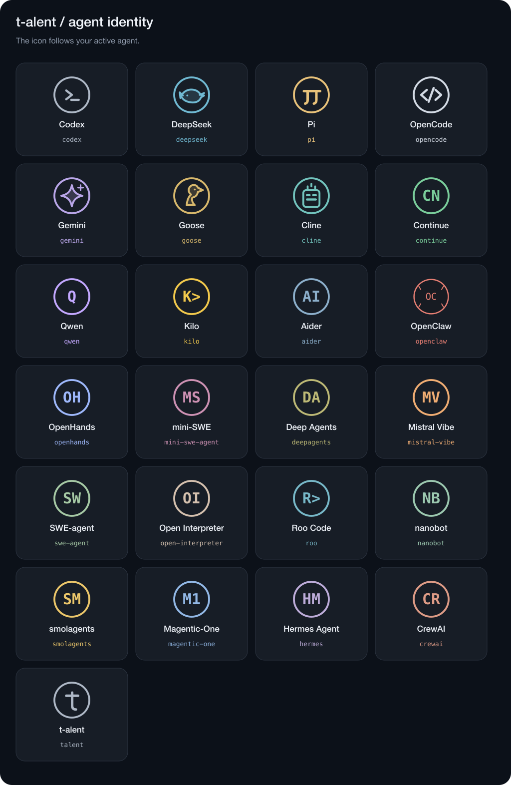

# t-alent CLI

终端版与网页版本共用 Agent 包、模型注册表和包行为配置，直接在 Node 中运行包，不需要启动 Vite 或 HTTP 宿主。界面参照 Codex CLI 的简洁终端风格，保留 t-alent 名称：启动信息、带包标识的 `›` 输入提示、`•` 任务输出、模型与 Harness 状态、工作计时、斜杠命令与键盘选择。

流式预览按终端高度显示，任务完成后完整回复保留在终端历史中。中文、长输入和窄终端会自动适配；工具结果提供简短预览。

## Agent 图标

以 Codex 的圆形 `>_` 标识为基准，各个 Harness 包各有一套颜色、图案和输入标记。宽终端的启动区显示字符图标；窄终端显示紧凑标记。使用 `/harness` 切换包或 `/resume` 恢复会话后，图标、输入提示与任务状态随当前包更新；`/model` 只切换模型，保持包图标。

未选择包时使用 t-alent 标识，自定义包使用包 ID 末段的前两个字母或数字作为缩写。标识根据已加载包的 `manifest.id` 确定，不根据模型提供商猜测，也不会自动加载包。`/clear` 重绘当前包的启动区。颜色设置仍遵循 `NO_COLOR` 和 `--no-color`，exec 与 JSON 输出保持纯任务结果。



终端标识定义位于 `apps/cli/agent-identity.mjs`，透明背景 SVG 图标位于 `apps/cli/assets/icons/`，可用于后续界面复用。

## 启动

```sh
npm install
cp config/models.example.json config/models.local.json
# 修改模型配置里的型号，并在环境中设置对应密钥
npm run cli -- --package ./packs/deepseek --package ./packs/codex \
  --models config/models.local.json --workspace .
```

使用 `/harness` 选择已显式加载的包，使用 `/model` 选择独立配置的模型。也可以启动时预选：

```sh
node apps/cli/index.mjs --package ./packs/codex \
  --models config/models.local.json --workspace . \
  --harness codex --model openai-gpt-6-sol
```

模型参数使用注册表的 `id`，不是上游型号。包声明的协议必须与模型协议兼容。未选择可用包和模型时，界面仍可管理选择和查看帮助，但无法运行任务。注册表可以显式设置 `defaultModelId`；没有设置时，不会自动选第一个模型。框架不会自动加载包。

`npm run cli:all -- --models config/models.local.json --workspace .` 显式加载所有已注册包。各包的运行环境要求与网页宿主一致，例如 Goose 需要单独安装固定版本的 CLI。

## 命令与快捷键

| 命令 | 用途 |
| --- | --- |
| `/help` | 查看命令和快捷键 |
| `/harness [id]` | 选择已加载的包；不传 ID 时打开选择器 |
| `/model [id]` | 选择注册表中的模型；不传 ID 时打开选择器 |
| `/new` | 创建新会话 |
| `/resume [id]` | 列出并恢复本地会话 |
| `/status` | 查看工作区、包、模型和会话 |
| `/clear` | 清理终端显示 |
| `/quit` | 退出并释放运行时 |

选择器支持上下方向键、Enter 确认和 Esc 返回。输入区支持历史、Tab 补全斜杠命令与 Ctrl+J 多行输入。执行期间，Esc 或 Ctrl+C 取消当前任务并等待包停止；空闲时 Ctrl+C 退出。任务运行期间不能切换包和模型或提交重叠任务。

切换包或模型会创建新会话。新会话还锁定包版本、来源 Agent 版本和编译指纹；恢复需要相同工作区、状态目录及未改变的包和模型。提示词或流程改变后请使用 `/new` 开始新会话。上游历史的恢复能力由所选 Harness 提供。

## 单次任务与管道

```sh
node apps/cli/index.mjs exec --package ./packs/codex \
  --models config/models.local.json --workspace . \
  --harness codex --model openai-gpt-6-sol \
  "Explain the structure of this repository"
```

`--exec` 与 `exec` 子命令等价。添加 `--json` 后，标准输出是逐行 JSON 任务事件，可供其他程序解析。文本模式输出助手回复，任务错误使用非零退出码。使用 Node 入口可避免 `npm run` 自身的启动日志混入管道。

用 `-` 从标准输入读取任务：

```sh
printf 'Explain the structure of this repository' | \
  node apps/cli/index.mjs exec --package ./packs/codex \
    --models config/models.local.json --harness codex \
    --model openai-gpt-6-sol --json -
```

非交互终端必须使用 exec 模式。重定向输出、设置 `NO_COLOR` 或使用 `--no-color` 会关闭颜色。

## 参数与存储

| 参数 | 用途 |
| --- | --- |
| `--package <path>` | 显式加载可信本地包，可以重复 |
| `--workspace <path>`、`-C <path>` | 工作区，默认当前目录 |
| `--models <file>` | 独立模型注册表 |
| `--config <file>` | 按包 ID 配置 Harness 行为 |
| `--state-dir <path>` | 状态目录，默认工作区下的 `.talent` |
| `--harness <id>` | 预选已加载包 |
| `--model <id>`、`-m <id>` | 预选注册表模型 |
| `--resume <id>` | 恢复本地会话 |
| `--exec` | 执行一条任务后退出 |
| `--json` | exec 模式下输出 NDJSON |
| `--no-color` | 关闭颜色 |
| `--help`、`-h` | 帮助 |
| `--version`、`-v` | 版本 |

包状态位于 `<state-dir>/<package-id>`，CLI 会话元数据与输入历史位于 `<state-dir>/cli`，编译缓存位于 `<state-dir>/cache/agents`。包的 JSON/提示词结构、编译与来源版本记录见 [Agent 包指南](AGENT-PACKAGES.md)。状态中可能包含任务文本，模型 JSON 只保存密钥环境变量名。密钥从进程环境读取，CLI 不自动加载 `.env`。如需显式加载本地环境文件：

```sh
node --env-file=.env apps/cli/index.mjs --package ./packs/codex \
  --models config/models.local.json --workspace .
```

`npm run test:cli` 使用本地测试包验证参数、模型选择、任务事件、取消和清理，不调用付费模型 API。
